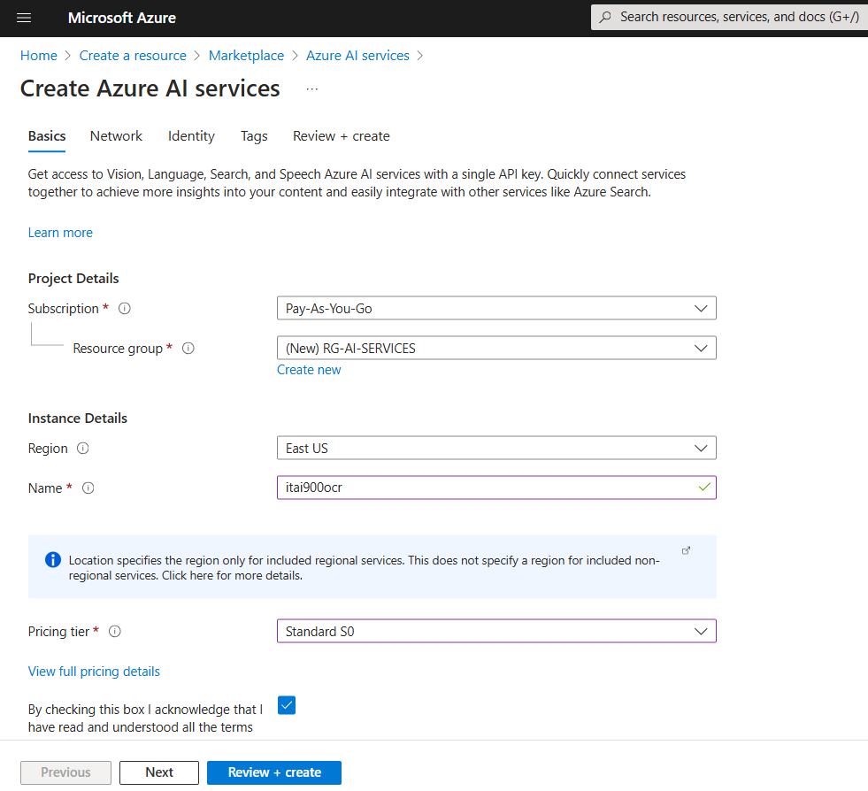
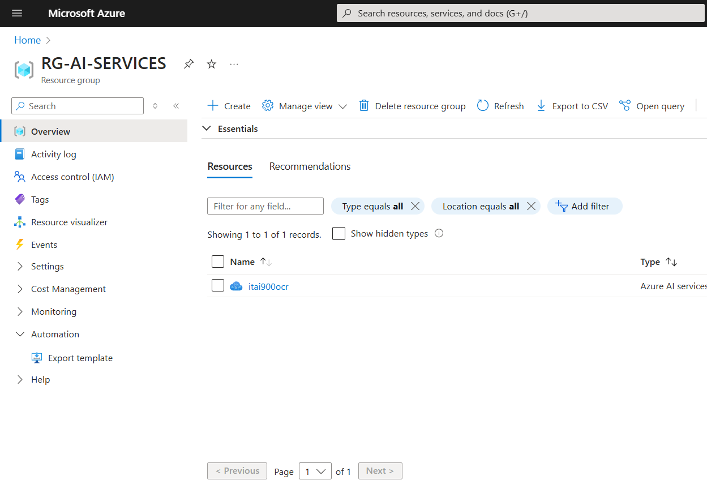
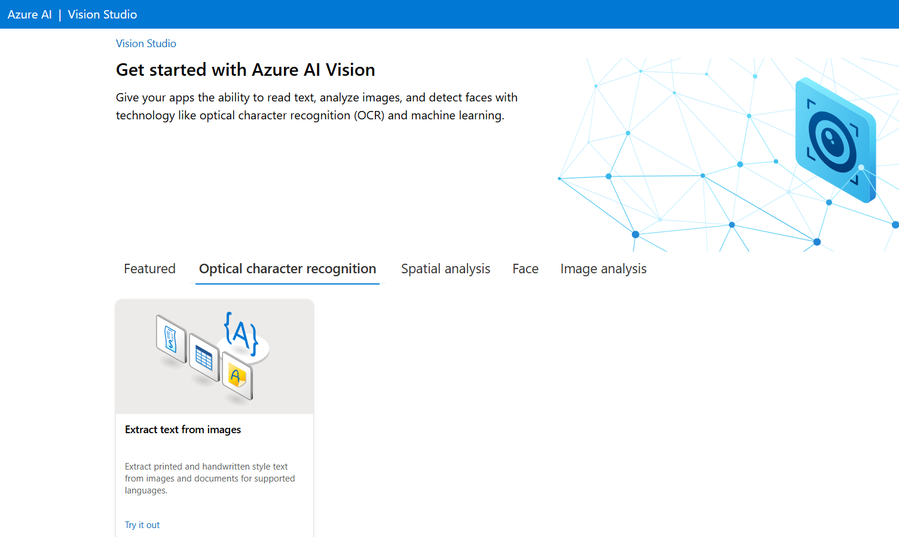
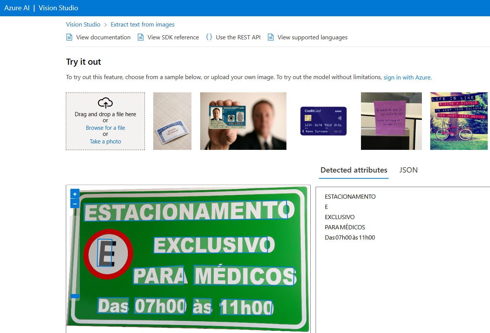
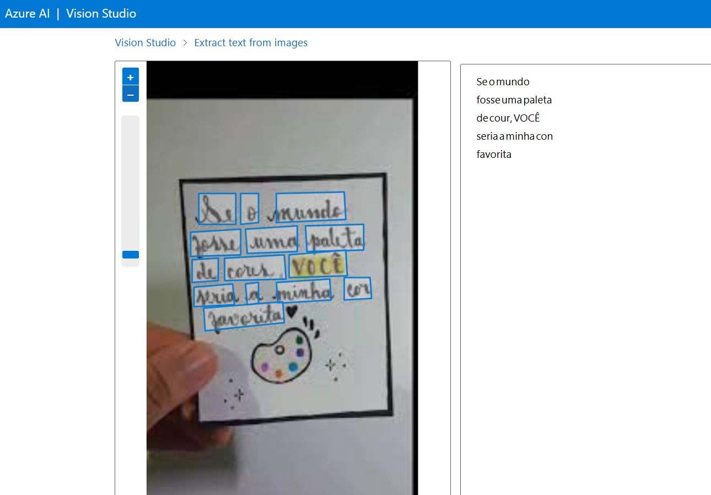
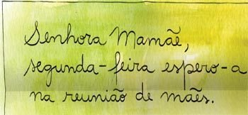
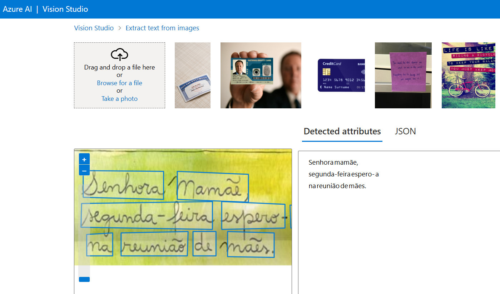

# Extraindo Texto de Imagem no Azure Studio

Neste laboratório, será usado o serviço Azure AI para explorar os recursos de reconhecimento óptico de caracteres (OCR) do Azure AI Vision. O Vision Studio permitirá experimentar a extração de texto de imagens, sem precisar escrever nenhum código.

## Criar um Recurso do Azure AI Services

Para usar o OCR do Azure AI Vision, é necessário provisionar um recurso do Azure AI Services em uma assinatura do Azure. Em seguida, pode-se usar o Azure AI Vision Studio para testar as funcionalidades de reconhecimento óptico de caracteres. 

  

Após isso, clique no botão `Go to resource`.

Na página do resource group, veja a instância criada `itai900ocr`. 

  

## Conectando o Recurso do Azure AI Services ao Vision Studio

Acesse a página do Vision Studio em https://portal.vision.cognitive.azure.com.

  

Selecione a guia `Optical character recognition` e na seção `Extract text from image` clique em **try it out**.

## Extraindo Texto de Imagens

Faça a upload das imagens que possuem texto e o OCR reconhecerá o texto nas imagens e retornará o resultado.

### Imagem 1

**Entrada**

  

**Saída**

  

### Imagem 2

**Entrada**

  

**Saída**

  

### Imagem 3

**Entrada**

  

**Saída**

